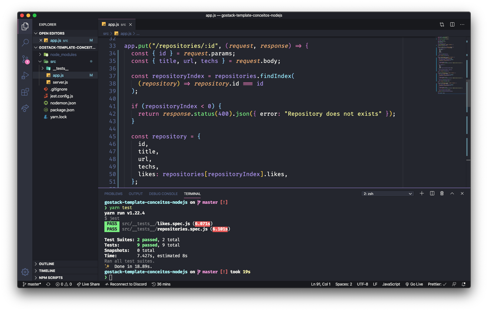
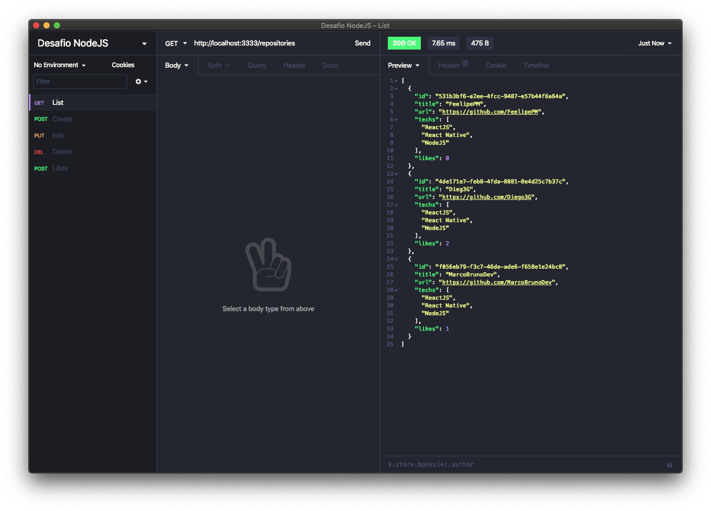

<h3 align="center">
  Desafio: Conceitos do Node.js
</h3>

“Aprendizado é um processo e você não vai ser um expert em uma semana.” by Diego Fernandes</blockquote>

  <a href="#rocket-sobre-o-desafio">Sobre o desafio</a>&nbsp;&nbsp;&nbsp;|&nbsp;&nbsp;&nbsp;
  <a href="#preview">Preview</a>&nbsp;&nbsp;&nbsp;|&nbsp;&nbsp;&nbsp;
  <a href="#licença">Licença</a>

## Sobre o desafio

A idéia é criar uma aplicação para treinar o que foi estudado até agora com Node.js!

A aplicação armazena repositórios do seu portfólio, permitindo a criação, listagem, atualização e remoção dos repositórios, e além disso permitir que os repositórios possam receber "likes".

Acesse a pasta criada e abra no Visual Studio Code, lembre-se de executar o comando `yarn` no seu terminal para instalar todas as dependências.

## Preview

  

  

## Licença

Esse projeto está sob a licença MIT. [LICENSE](LICENSE.md)

---

Feito com ❣️ by Felipe Machado
